# Mantle DeFAI Trader — 前后端架构与业务逻辑分析

> 生成时间: 2026-06-08

---

## 一、项目概览

本项目是一个面向 **Mantle 生态的 DeFAI（DeFi + AI）交易 Agent 平台**，包含：

| 模块 | 技术栈 | 路径 | 状态 |
|------|--------|------|------|
| **新版前端** | React 19 + TypeScript + Vite + Wagmi | `apps/web-react/` | ✅ 活跃开发 |
| **旧版前端** | 原生 JS + ethers.js v5 | `apps/web/` | 📦 归档 |
| **后端 API** | FastAPI + Web3.py + SQLite | `apps/api/` | ✅ 活跃 |
| **智能合约** | Foundry + Solidity ^0.8.19 | `contracts/` | ✅ 已部署 Sepolia |

部署链：**Mantle Sepolia Testnet** (Chain ID: 5003)
合约地址：`0x684802d365d1bbc0b74f7b57f823acdf965d1ba3`

---

## 二、系统整体架构

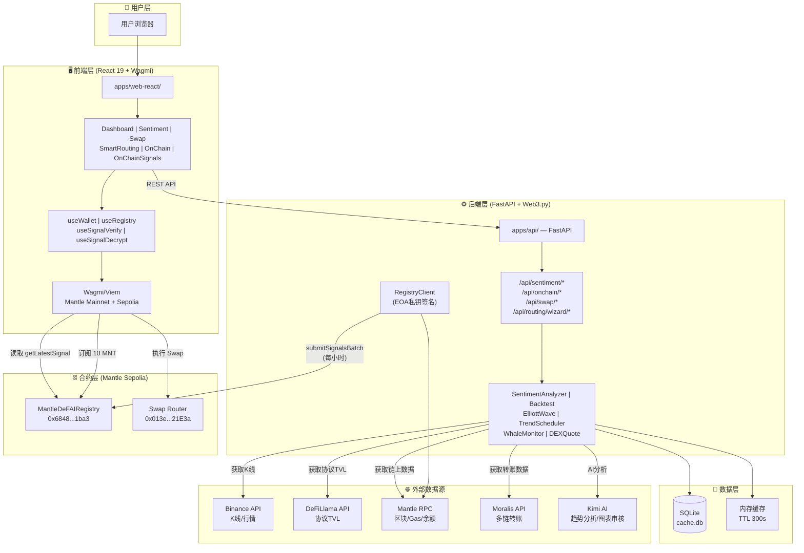

---

## 三、后端数据上链逻辑（核心流程）

### 3.1 上链流程全景

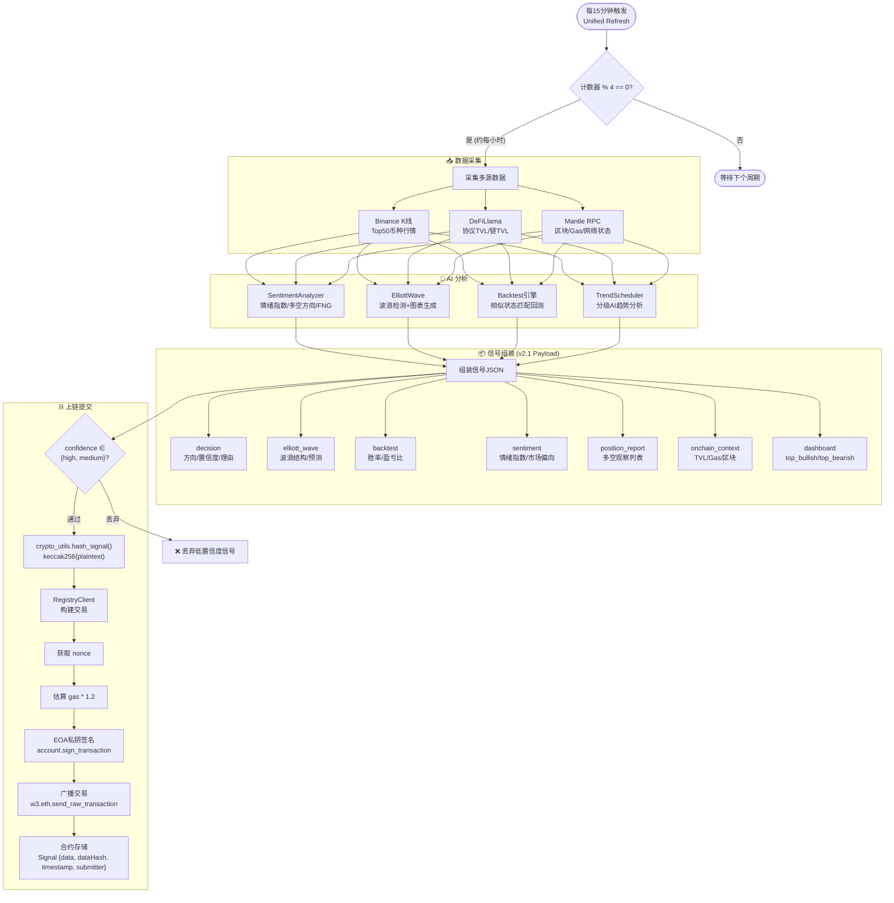

### 3.2 交易构建与签名细节

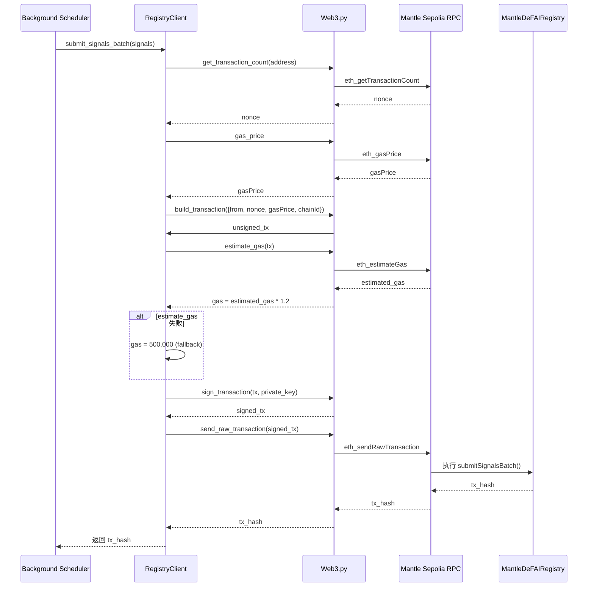

### 3.3 信号数据结构（v2.1）

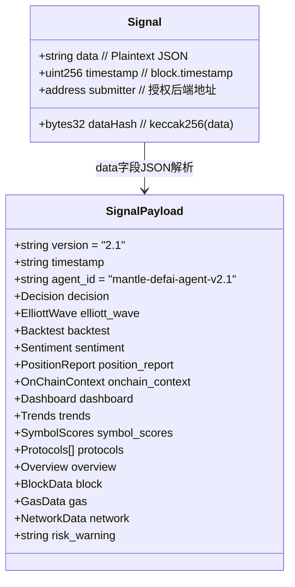

---

## 四、后端核心业务逻辑

### 4.1 后台调度器架构

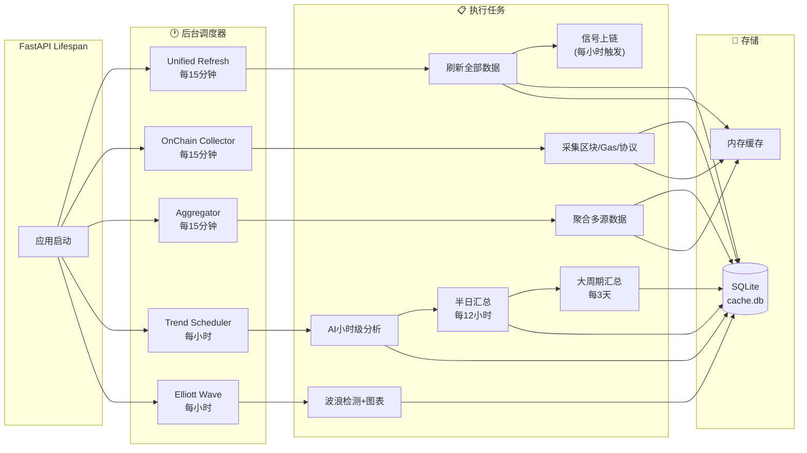

### 4.2 情绪分析流程

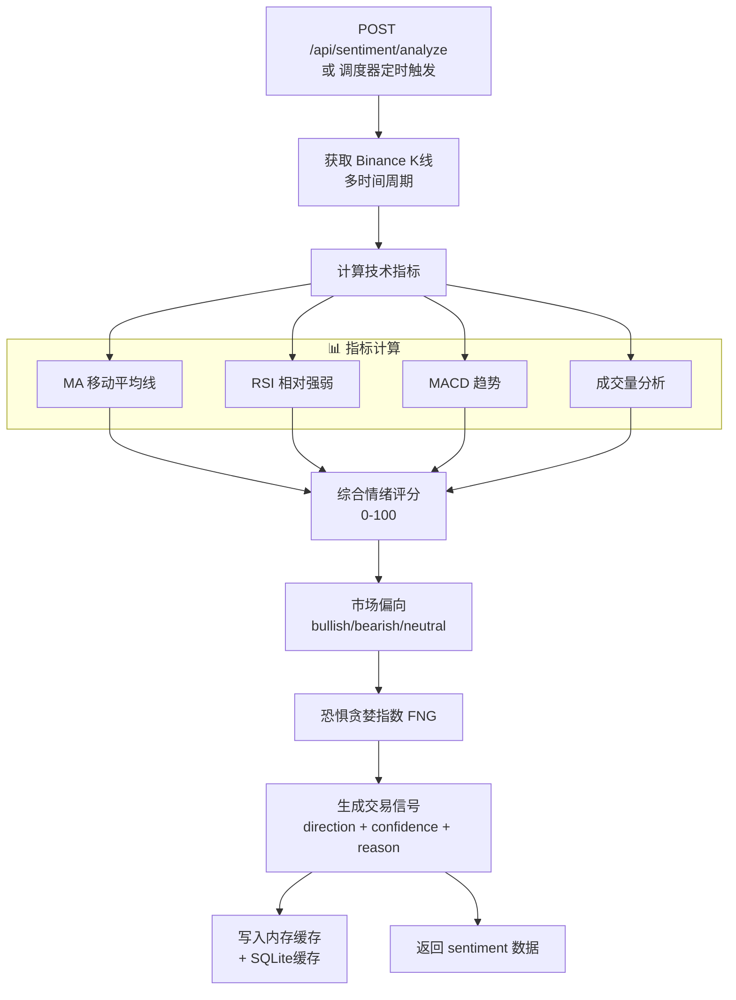

### 4.3 回测引擎流程

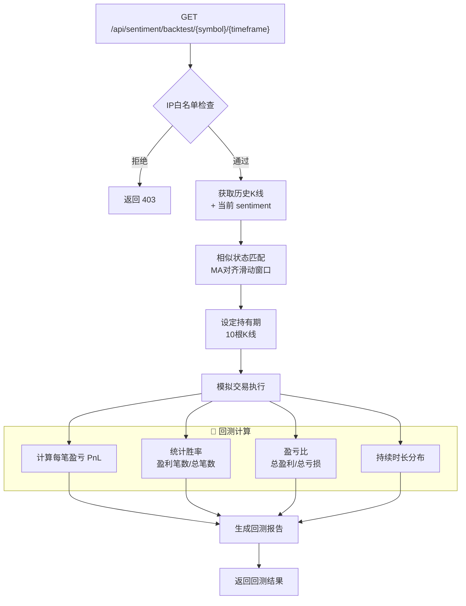

### 4.4 智能路由向导流程（8步状态机）

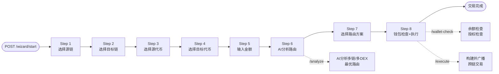

---

## 五、前端交互流程

### 5.1 页面路由与数据来源

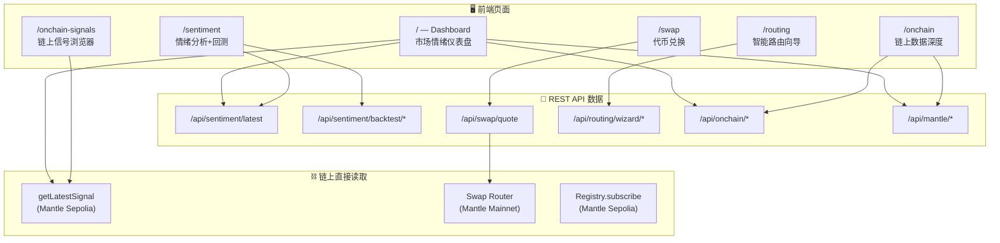

### 5.2 Swap 交易执行流程

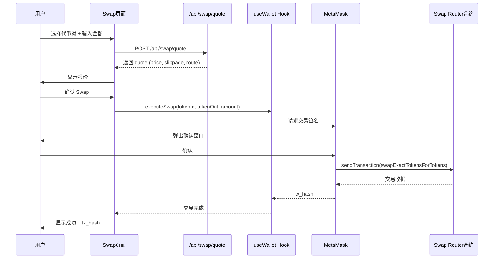

### 5.3 链上信号读取与验证流程

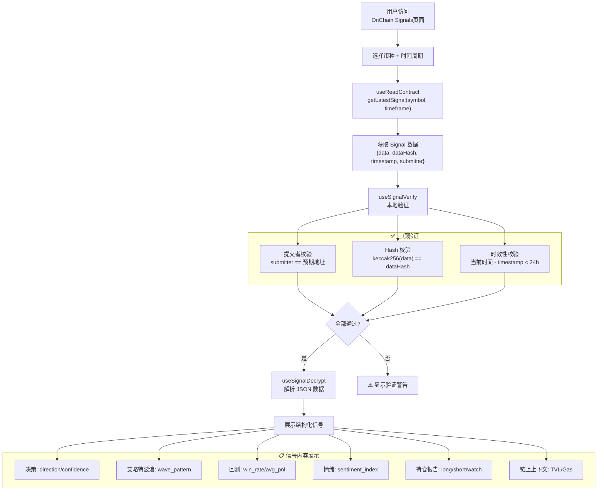

---

## 六、关键文件索引

### 前端
| 文件 | 职责 |
|------|------|
| `apps/web-react/src/App.tsx` | 路由定义 |
| `apps/web-react/src/services/api.ts` | API 客户端 (axios) |
| `apps/web-react/src/hooks/useWallet.ts` | 钱包连接 + Swap 执行 |
| `apps/web-react/src/hooks/useRegistry.ts` | 合约读写（订阅/查询） |
| `apps/web-react/src/hooks/useSignalVerify.ts` | 信号本地验证 |
| `apps/web-react/src/hooks/useSignalDecrypt.ts` | 信号 JSON 解析 |
| `apps/web-react/src/pages/Dashboard.tsx` | 主仪表盘 |
| `apps/web-react/src/pages/Sentiment.tsx` | 情绪分析 + 回测 |
| `apps/web-react/src/pages/OnChainSignals.tsx` | 链上信号浏览器 |

### 后端
| 文件 | 职责 |
|------|------|
| `apps/api/main.py` | FastAPI 入口 + 启动后台任务 |
| `apps/api/routes.py` | 主 APIRouter（所有 /api/*） |
| `apps/api/routing_wizard.py` | 智能路由向导 |
| `apps/api/contract_client.py` | RegistryClient（上链交易） |
| `apps/api/background.py` | 后台刷新 + 信号上链 |
| `apps/api/clients.py` | Binance/Mantle/DEX 客户端 |
| `apps/api/backtest.py` | 回测引擎 |
| `apps/api/elliott_wave.py` | 艾略特波浪检测 |
| `apps/api/kimi_analyzer.py` | Kimi AI 趋势分析 |
| `apps/api/onchain_collector.py` | 链上数据收集 |
| `apps/api/crypto_utils.py` | keccak256 哈希工具 |

### 合约
| 文件 | 职责 |
|------|------|
| `contracts/src/MantleDeFAIRegistry.sol` | 核心信号注册表合约 |
| `contracts/script/DeployRegistry.s.sol` | 部署脚本 |

---

## 七、安全与访问控制

| 机制 | 实现 | 位置 |
|------|------|------|
| IP 白名单 | `IP_WHITELIST` 环境变量 | `apps/api/core.py` |
| 限流 | 100 请求/60秒 | `apps/api/core.py` |
| 回测保护 | `require_whitelist()` 装饰器 | `apps/api/routes.py` |
| DEBUG 模式 | 跳过白名单检查 | `apps/api/core.py` |
| 信号验证 | keccak256 + 授权提交者 + 时效 | 合约 + 前端 |
| EOA 私钥 | 环境变量 `REGISTRY_PRIVATE_KEY` | `apps/api/contract_client.py` |
